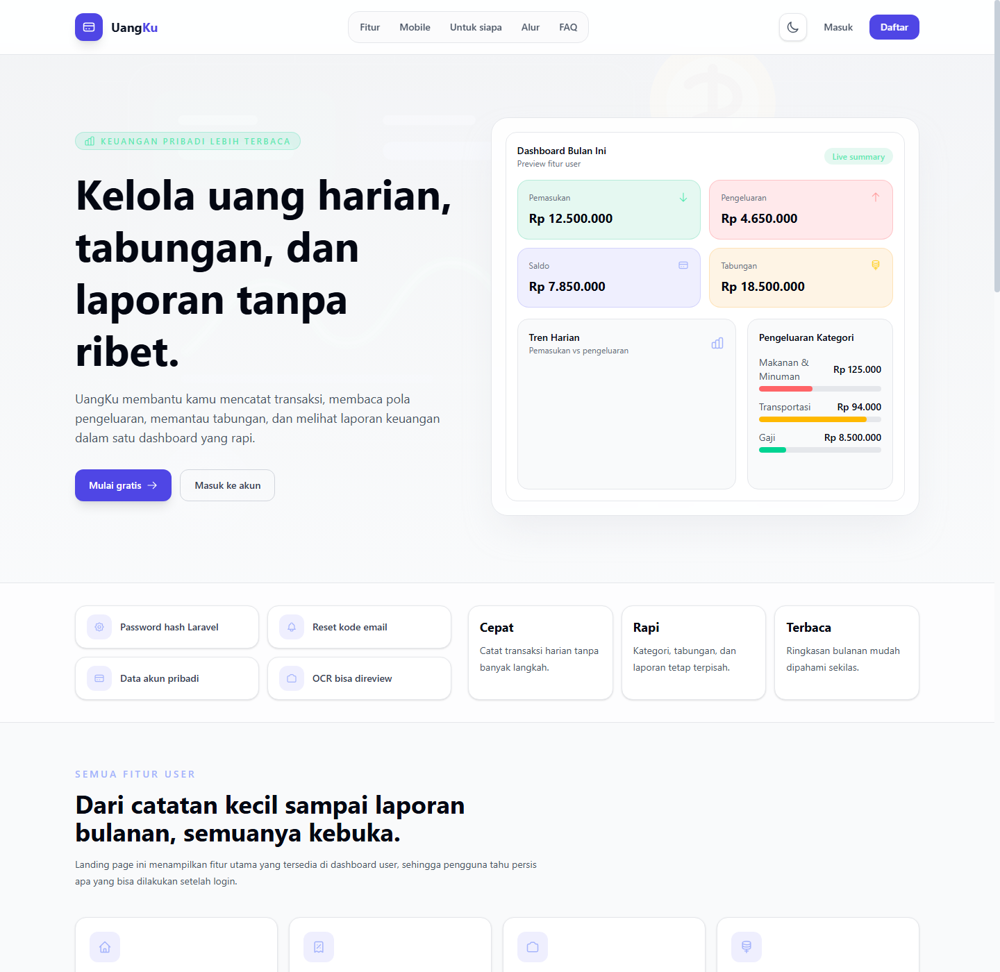

# UangKu

UangKu adalah aplikasi manajemen keuangan pribadi berbasis Laravel, Inertia, dan React. Aplikasi ini dirancang untuk mencatat transaksi harian, mengelola kategori, memantau tabungan, membaca laporan bulanan, dan menyediakan jalur feedback antara pengguna dan admin.

## Daftar Isi

- [Preview Aplikasi](#preview-aplikasi)
- [Fitur Utama](#fitur-utama)
- [Role dan Hak Akses](#role-dan-hak-akses)
- [Alur Penggunaan](#alur-penggunaan)
- [Stack Teknologi](#stack-teknologi)
- [Setup Lokal](#setup-lokal)
- [Akun Seeder](#akun-seeder)
- [Command Pengembangan](#command-pengembangan)
- [Testing](#testing)
- [Struktur Proyek](#struktur-proyek)
- [Catatan Keamanan](#catatan-keamanan)

## Preview Aplikasi

### Landing Page

Halaman awal berada di route `/` dan menampilkan identitas UangKu, navigasi fitur, preview mobile, segmen pengguna, alur penggunaan, keamanan, FAQ, dan footer.



```text
/
|-- Hero UangKu
|-- Fitur user
|-- Preview mobile
|-- Cocok untuk siapa
|-- Alur pakai
|-- Keamanan & privasi
|-- FAQ
|-- CTA login/register
```

### Preview Route User

| Route | Halaman | Ringkasan |
| --- | --- | --- |
| `/dashboard` | Dashboard | Ringkasan bulan berjalan, tren harian, breakdown kategori, perbandingan 6 bulan, dan 8 transaksi terbaru. |
| `/transactions` | Transaksi | Daftar transaksi periodik, input manual, quick input teks, OCR struk, ringkasan pemasukan/pengeluaran, dan paginasi 15 item. |
| `/transactions/ocr-review` | Review OCR | Draft hasil scan struk sebelum disimpan sebagai transaksi. |
| `/categories` | Kategori | Kelola kategori pemasukan/pengeluaran dengan icon, warna, keyword, dan jumlah pemakaian. |
| `/savings` | Tabungan | Kelola rekening tabungan, saldo pokok, mutasi setor/tarik, estimasi bunga, dan total estimasi saldo. |
| `/reports` | Laporan | Laporan bulanan, rata-rata pengeluaran per hari, breakdown kategori, dan komparasi 6 bulan. |
| `/feedback` | Feedback | Daftar thread feedback pengguna beserta jumlah balasan. |
| `/feedback/create` | Buat Feedback | Kirim feedback dengan pesan dan lampiran opsional. |
| `/profile` | Profil | Update nama, email, password, dan hapus akun. |

### Preview Route Admin

| Route | Halaman | Ringkasan |
| --- | --- | --- |
| `/admin/dashboard` | Dashboard Admin | Statistik agregat user dan transaksi tanpa membuka detail transaksi per user. |
| `/admin/users` | Manajemen User | Cari, buat, update, hapus user, dan atur role admin jika login sebagai super admin. |
| `/admin/settings` | Pengaturan | Toggle registrasi dan OCR. |
| `/admin/feedbacks` | Feedback Admin | Kelola semua feedback, filter status, baca lampiran, balas user, ubah status, dan hapus thread. |

## Fitur Utama

### 1. Landing Page

- Header fixed dengan navigasi section landing page.
- CTA login/register menyesuaikan status autentikasi dan ketersediaan route register.
- Section fitur, preview mobile, target pengguna, alur penggunaan, keamanan, FAQ, dan footer.
- Favicon SVG dan `theme-color` untuk branding browser.
- Dukungan dark mode lewat komponen `ThemeToggle`.

### 2. Autentikasi

- Register, login, logout, forgot password, reset password, confirm password, dan verify email.
- Reset password memakai `ResetPasswordCodeNotification`.
- Registrasi dapat dinyalakan atau dimatikan dari pengaturan admin melalui key `registration_enabled`.
- User baru mendapat kategori default melalui `SeedDefaultCategories`.
- Password disimpan menggunakan hash Laravel.

### 3. Dashboard User

Dashboard user membaca data bulan berjalan:

- Total pemasukan.
- Total pengeluaran.
- Saldo bulan berjalan.
- Estimasi total tabungan.
- Jumlah transaksi bulan berjalan.
- Tren harian pemasukan vs pengeluaran.
- Breakdown pengeluaran per kategori.
- Perbandingan pemasukan vs pengeluaran 6 bulan terakhir.
- 8 transaksi terbaru.

Jika user yang login adalah admin, akses `/dashboard` otomatis diarahkan ke `/admin/dashboard`.

### 4. Transaksi

- Mendukung tipe transaksi `income` atau `expense`.
- Input manual dengan deskripsi, nominal, kategori, dan tanggal.
- Periode daftar transaksi bisa dipilih berdasarkan `day`, `week`, atau `month`.
- Ringkasan periode berisi total pemasukan, total pengeluaran, dan saldo.
- Breakdown kategori hanya menghitung transaksi pengeluaran.
- Daftar transaksi dipaginasi 15 item per halaman.
- Update dan hapus transaksi hanya bisa dilakukan oleh pemilik transaksi.
- Setiap transaksi menyimpan `source`: `manual`, `text`, atau `ocr`.

### 5. Quick Input Teks

Quick input menggunakan `TextExpenseParser` untuk membaca teks bebas menjadi transaksi.

Contoh input:

```text
beli nasi ayam 25rb
gaji freelance 2jt
bayar internet 350.000
```

Kemampuan parser:

- Membaca nominal dengan format rupiah normal, `rb`, `ribu`, `k`, `jt`, atau `juta`.
- Mengambil nominal terbesar jika ada beberapa angka.
- Mendeteksi pemasukan dari kata seperti `gaji`, `bonus`, `thr`, `masuk`, `pemasukan`, dan sejenisnya.
- Selain kata kunci pemasukan, transaksi dianggap sebagai pengeluaran.
- Membersihkan noise word seperti `beli`, `bayar`, `rp`, `harga`, `buat`, dan `untuk`.
- Menebak kategori dari keyword kategori milik user.
- Batas input maksimal 500 karakter.

### 6. OCR Struk

OCR struk memanfaatkan tesseract.js di browser, lalu backend memproses text/TSV melalui `ReceiptOcrService`.

Alur OCR:

```text
Upload/foto struk
-> tesseract.js membaca gambar di browser
-> raw TSV atau raw text dikirim ke backend
-> backend membersihkan dan memecah item
-> draft disimpan di session
-> user review item di /transactions/ocr-review
-> item disimpan sebagai transaksi source=ocr
```

Kemampuan OCR:

- Bisa menerima `raw_tsv` sampai 500000 karakter atau `raw_text` sampai 50000 karakter.
- TSV direkonstruksi berdasarkan posisi kata agar baris lebih rapi.
- Mengabaikan noise seperti nomor nota, tanggal, jam, subtotal, total item, pajak, diskon, ongkir, kasir, alamat, barcode, nomor telepon, URL, dan kode transaksi.
- Mendukung format struk single-line seperti `Roti Tawar 12.000`.
- Mendukung format double-line seperti nama barang di satu baris lalu qty/harga di baris berikutnya.
- Mendukung marker qty seperti `1X`, `2 @`, `pcs`, `buah`, `porsi`, `kg`, `ml`, dan sejenisnya.
- Total diprioritaskan dari baris `total`, `grand total`, `total belanja`, atau `jumlah bayar`.
- Jika item tidak terdeteksi, fallback menjadi satu item memakai nama merchant dan total.
- OCR dapat dinonaktifkan admin melalui key `ocr_enabled`.

### 7. Kategori

- Kategori selalu scoped ke user pemiliknya.
- Kategori memiliki nama, tipe, icon, warna, keyword, dan flag default.
- Nama kategori unik per user dan per tipe transaksi.
- Keyword dipakai untuk menebak kategori pada quick input dan OCR.
- Daftar kategori menampilkan jumlah transaksi yang memakai kategori tersebut.

Kategori default yang dibuat untuk user baru:

| Tipe | Kategori |
| --- | --- |
| Pengeluaran | Makanan & Minuman, Transport, Belanja, Tagihan, Kesehatan, Hiburan, Lainnya |
| Pemasukan | Gaji, Bonus, Pemasukan Lain |

### 8. Tabungan

- User bisa membuat banyak rekening tabungan.
- Setiap tabungan menyimpan bank, nama tabungan, saldo pokok, status bunga, bunga tahunan, periode bunga, dan tanggal mulai bunga.
- Nama tabungan otomatis menjadi `Tabungan {Nama Bank}` jika dikosongkan.
- Mutasi tabungan mendukung `deposit` atau `withdrawal`.
- Penarikan tidak boleh melebihi saldo tersimpan.
- Mutasi hanya boleh bertanggal hari ini atau masa lalu.
- Ringkasan tabungan menghitung pokok, estimasi bunga, total estimasi, dan jumlah rekening.

Perhitungan estimasi bunga:

- Periode bunga tersedia: harian, bulanan, tahunan.
- Bunga dihitung dari saldo harian sejak `interest_started_at`.
- Rate harian dihitung dari bunga tahunan dibagi 365.
- Bunga dikreditkan sesuai periode, lalu dapat ikut menambah saldo perhitungan berikutnya.
- Aplikasi menampilkan `stored_balance_amount`, `estimated_interest_amount`, `estimated_balance_amount`, `duration_days`, dan `duration_months`.

### 9. Laporan

Laporan berada di `/reports` dan memakai query `month` dengan format `YYYY-MM`.

Isi laporan:

- Total pemasukan bulan terpilih.
- Total pengeluaran bulan terpilih.
- Saldo bersih bulan terpilih.
- Jumlah transaksi bulan terpilih.
- Rata-rata pengeluaran per hari.
- Breakdown pengeluaran per kategori.
- Breakdown pemasukan per kategori.
- Komparasi pemasukan dan pengeluaran 6 bulan sampai bulan terpilih.

### 10. Feedback User

- User dapat membuat thread feedback dengan subject dan message.
- Message maksimal 5000 karakter.
- Lampiran opsional maksimal 5 file.
- Ukuran per lampiran maksimal 5120 KB.
- Format lampiran: `jpg`, `jpeg`, `png`, `gif`, `webp`, `pdf`, `txt`.
- User dapat melihat thread feedback miliknya sendiri.
- User dapat membalas thread feedback miliknya.
- Saat user membalas, feedback ditandai unread untuk admin.

### 11. Admin Dashboard

Dashboard admin hanya menampilkan statistik agregat:

- Total regular user.
- Active user yang sudah punya transaksi.
- User baru bulan ini.
- Total transaksi.
- Transaksi bulan ini.
- Tren signup 6 bulan.
- Tren jumlah transaksi 6 bulan.

### 12. Manajemen User Admin

- Admin dapat melihat user dengan search nama/email.
- Daftar user dipaginasi 10 item.
- Menampilkan jumlah transaksi dan kategori per user.
- Admin dapat membuat user baru.
- Saat admin membuat user, kategori default ikut dibuat.
- Super admin dapat mengatur role admin.
- Admin biasa tidak bisa mengubah atau menghapus akun admin.
- User tidak bisa menghapus akunnya sendiri dari panel admin.

### 13. Pengaturan Admin

Pengaturan admin berada di `/admin/settings`.

| Setting | Penyimpanan | Dampak |
| --- | --- | --- |
| `registration_enabled` | Database `app_settings` | Menyalakan/mematikan registrasi user baru. |
| `ocr_enabled` | Database `app_settings` | Menyalakan/mematikan fitur scan struk. |
### 14. Manajemen Feedback Admin

- Admin melihat semua thread feedback.
- Filter berdasarkan status.
- Counter tersedia untuk all, unread, open, in progress, dan resolved.
- Membuka detail feedback otomatis menandai feedback sebagai read by admin.
- Admin bisa membalas feedback.
- Balasan admin membuat feedback unread untuk user.
- Jika status masih open, balasan admin otomatis mengubah status menjadi in progress.
- Admin bisa mengubah status ke `open`, `in_progress`, `resolved`, atau `closed`.
- Admin bisa menghapus thread feedback.

## Role dan Hak Akses

| Role | Akses |
| --- | --- |
| Guest | Landing page, login, register jika aktif, forgot password, reset password. |
| User | Dashboard, transaksi, OCR, kategori, tabungan, laporan, feedback, profil. |
| Admin | Dashboard admin, manajemen user, settings, dan feedback admin. |
| Super Admin | Semua akses admin plus kemampuan mengatur role admin user lain. |

## Alur Penggunaan

```text
Register/Login
-> kategori default dibuat
-> catat transaksi manual / quick input / OCR
-> kelola kategori dan tabungan
-> baca dashboard dan laporan
-> kirim feedback jika ada kendala
-> admin memantau statistik, user, setting, dan feedback
```

## Stack Teknologi

- PHP 8.3
- Laravel 13
- Laravel Breeze
- Laravel Sanctum
- Inertia Laravel 2
- React 18
- Tailwind CSS 4
- Vite 8
- Recharts
- tesseract.js
- PHPUnit 12
- Laravel Pint

## Setup Lokal

### Prasyarat

- PHP 8.3+
- Composer
- Node.js dan npm
- Database yang didukung Laravel
- Ekstensi PHP umum untuk Laravel, database, file upload, dan mailer

### Instalasi

```bash
composer install
npm install
```

Salin file environment:

```bash
cp .env.example .env
```

Untuk PowerShell:

```powershell
Copy-Item .env.example .env
```

Generate app key, migrasi database, dan seed data awal:

```bash
php artisan key:generate
php artisan migrate --seed
php artisan storage:link
```

Build aset frontend:

```bash
npm run build
```

Jalankan aplikasi:

```bash
composer run dev
```

Atau jalankan server secara terpisah:

```bash
php artisan serve
npm run dev
```

## Konfigurasi Penting

Pastikan `.env` disesuaikan dengan environment lokal:

```env
APP_NAME=UangKu
APP_URL=http://127.0.0.1:8000

DB_CONNECTION=mysql
DB_HOST=127.0.0.1
DB_PORT=3306
DB_DATABASE=manajemen_uang
DB_USERNAME=root
DB_PASSWORD=

MAIL_MAILER=smtp
MAIL_HOST=127.0.0.1
MAIL_PORT=1025
MAIL_USERNAME=null
MAIL_PASSWORD=null
MAIL_FROM_ADDRESS="noreply@uangku.test"
MAIL_FROM_NAME="${APP_NAME}"
```

Catatan:

- Konfigurasi mail dibutuhkan untuk reset password dan notifikasi kode.
- Lampiran feedback disimpan di disk `public`, jadi jalankan `php artisan storage:link`.
- OCR berjalan dari browser dengan tesseract.js, lalu backend hanya memproses hasil text/TSV.

## Akun Seeder

Seeder bawaan membuat akun super admin:

| Field | Nilai |
| --- | --- |
| Email | `superadmin@gmail.com` |
| Password | `admin123` |
| Role | Super Admin |

Ubah kredensial ini sebelum dipakai di lingkungan produksi.

## Command Pengembangan

```bash
npm run dev
npm run build
php artisan test --compact
vendor/bin/pint --dirty --format agent
```

Command Laravel yang sering dipakai:

```bash
php artisan route:list --except-vendor
php artisan migrate
php artisan migrate:fresh --seed
php artisan config:clear
```

## Testing

Project memakai PHPUnit. Jalankan seluruh test:

```bash
php artisan test --compact
```

Area yang sudah memiliki test:

- Authentication
- Profile
- Admin access
- Database seeder
- Transaction flow
- Text expense parser
- Category guesser
- Saving account

Jika mengubah PHP, jalankan formatter:

```bash
vendor/bin/pint --dirty --format agent
```

Jika mengubah frontend, jalankan build:

```bash
npm run build
```

## Struktur Proyek

```text
app/
|-- Actions/
|-- Enums/
|-- Http/
|   |-- Controllers/
|   |-- Middleware/
|   |-- Requests/
|-- Models/
|-- Notifications/
|-- Services/
|-- Support/

database/
|-- factories/
|-- migrations/
|-- seeders/

resources/js/
|-- Components/
|-- Layouts/
|-- Pages/
|   |-- Admin/
|   |-- Auth/
|   |-- Categories/
|   |-- Feedback/
|   |-- Profile/
|   |-- Reports/
|   |-- Savings/
|   |-- Transactions/
```

## Model Data Utama

| Model | Fungsi |
| --- | --- |
| `User` | Akun pengguna, role admin/super admin, relasi transaksi, kategori, tabungan, feedback. |
| `Transaction` | Catatan pemasukan/pengeluaran user dengan kategori, tanggal, source, dan raw input. |
| `Category` | Kategori transaksi per user dengan keyword untuk auto-guess. |
| `SavingAccount` | Rekening tabungan dengan saldo pokok dan estimasi bunga. |
| `SavingTransaction` | Mutasi setor/tarik pada rekening tabungan. |
| `Feedback` | Thread feedback dari user ke admin. |
| `FeedbackReply` | Balasan dalam thread feedback. |
| `FeedbackAttachment` | Lampiran file feedback. |
| `AppSetting` | Setting aplikasi berbasis key-value dengan cache. |

## Catatan Keamanan

- Password user di-hash oleh Laravel.
- Data transaksi, kategori, tabungan, dan feedback user dibatasi berdasarkan pemilik data.
- Admin dashboard hanya menampilkan statistik agregat.
- Registrasi dan OCR bisa dimatikan dari settings admin.
- Lampiran feedback dibatasi jumlah, ukuran, dan tipe file.
- Admin biasa tidak bisa mengubah atau menghapus akun admin lain.
- User tidak bisa menghapus akun sendiri dari panel admin.

## Troubleshooting

### Frontend tidak berubah

Jalankan salah satu:

```bash
npm run dev
npm run build
composer run dev
```

### File upload feedback tidak bisa diakses

Pastikan storage link sudah dibuat:

```bash
php artisan storage:link
```

### Reset password tidak mengirim email

Periksa konfigurasi `MAIL_*` di `.env` dan pastikan service SMTP lokal/produksi berjalan.

### OCR tidak tampil atau gagal menyimpan

- Pastikan setting OCR aktif di `/admin/settings`.
- Pastikan browser berhasil membaca gambar dengan tesseract.js.
- Review draft di `/transactions/ocr-review` sebelum menyimpan transaksi.

## Lisensi

Project ini menggunakan lisensi MIT.
